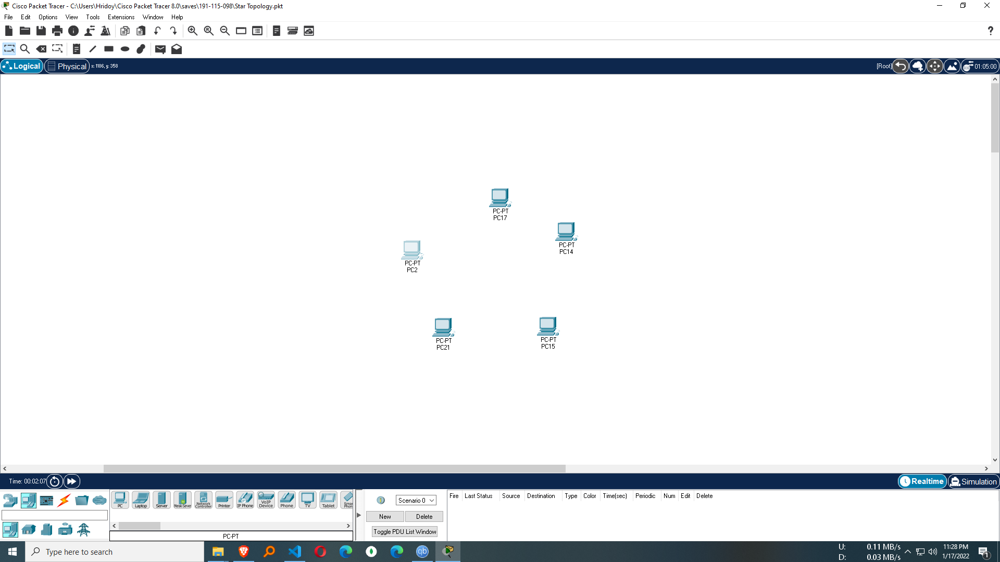
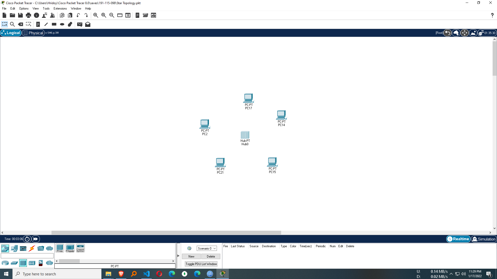
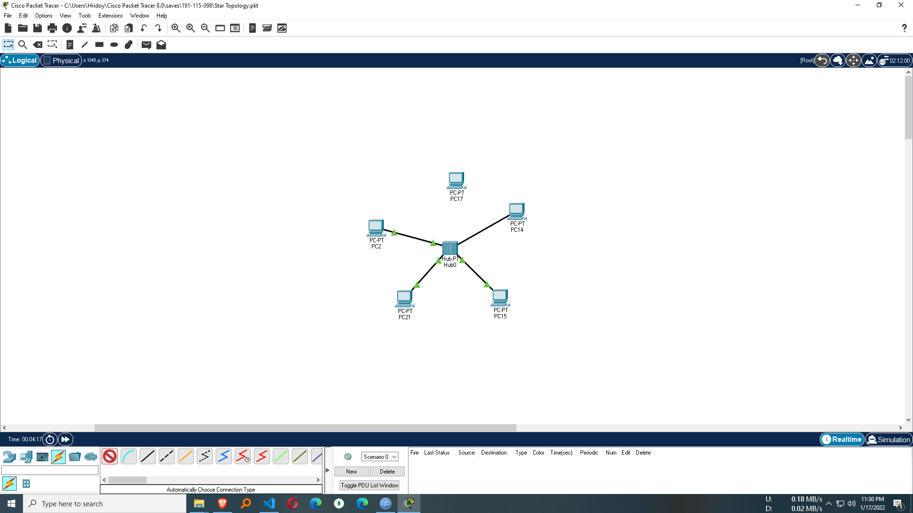
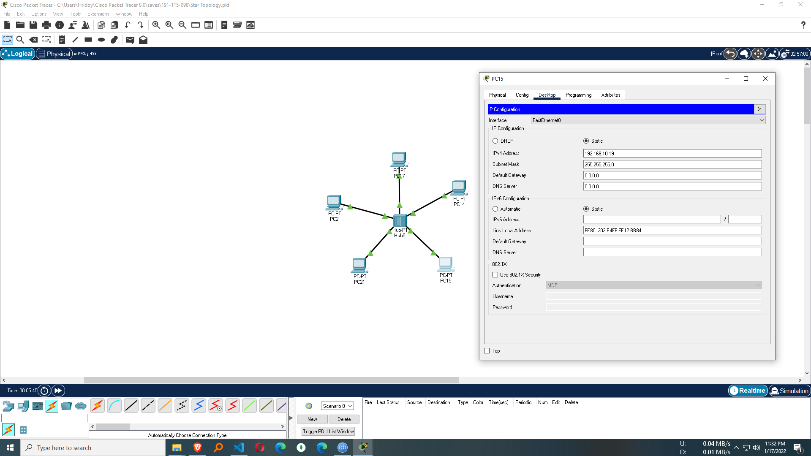
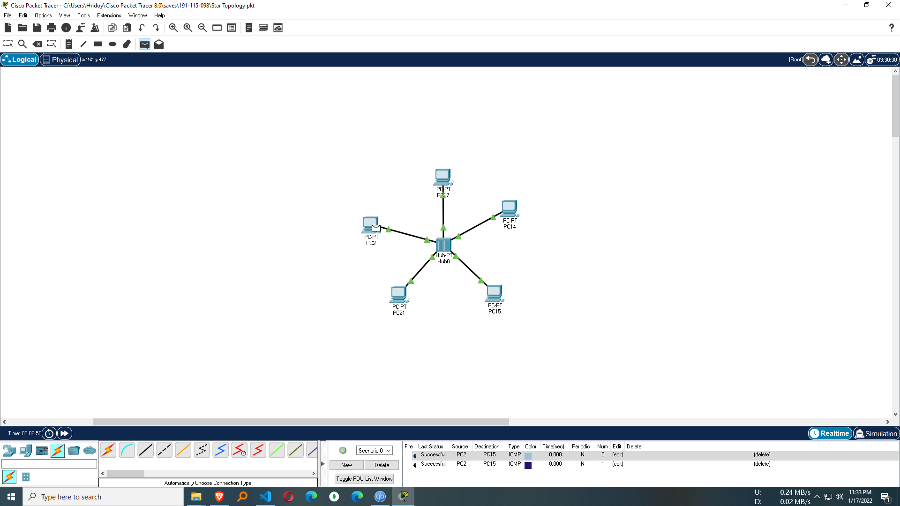

## Compiler-Construction
<h3 align="center" > Computer Network </h1>

## Course Summary
Computer Network Is One Of The Major Course of CSE. You'll Get This Course In 3nd Year.In This Course You'll Learn the concepts of networking in the protocol stack to design and implement a local area network. It explores the architecture, components, functions, protocols, and applications of the Internet and computer networks. Students learn how various network protocols run concurrently and interoperate together in the protocol stack to enable the transfer of data in the Internet.

## Lab 
you'll get some lab packet file in this repo, you'll learn how to build a network and send data among these network, protocl design, simulation of data transfer in network and more... before checking these packet file i strongly suggests you to try yourself first and then check these if you can't solve...

## Installing Necessary Software
- [Cisco Packet Tracker](https://www.computernetworkingnotes.com/ccna-study-guide/download-packet-tracer-for-windows-and-linux.html)

## How To Build Network 

  <b>Place Pc According to your desired network architecture (i'm making a star topology)</b> 
     
   <b>then place hub in the middle</b> 
     
    <b>then connect all the pc into hub using connector</b> 
     
    <b>Click in Pc and Set Ip Configuration</b> 
     
    <b>Send Message from one pc to another through network</b> 
     
    <b>Check All Ip Config</b> 
     
    <b>Check Mac Address</b> 
     
    <b>Check Ping Test</b> 
     

## Tology And Their Architecture

  <b>Ring Topology</b> 
     
   <b>Star Topology</b> 
     
    <b>Mesh Topology</b> 
     
    <b>Bus Topology</b> 
     
    <b>Hybrid Topology 1</b> 
     
    <b>Hybrid Topology 2</b> 
     
    <b>Router Connection</b> 
     

## Where To Learn
I've uploaded my teacher lectures pdf, anyone can learn from these lectures.also you can learn it from youtube and google or various educational site....
